[](https://travis-ci.org/ballerina-guides/microservices-observability)

# Observing Ballerina Microservices

Observability of services is useful to retrieve internal information for easier troubleshooting and system status analysis. Ballerina allows to observe its services using Monitoring, Logging and Distributed tracing methods, with the use of other external tools.

Ballerina observability can be categorized into two types as,
- Default observability - Each Ballerina service can expose its internal information just by enabling the built-in observability. (Eg : Network call duration)
- User-defined observability - More specific data can be retrieved by using user-defined observability. (Eg : Function execution time) This requires the explicit import of the package `ballerina/observe`.

> This guide is a modification of the [Parallel Service Orchestration guide](https://github.com/ballerina-guides/parallel-service-orchestration) to explain a real-world use case of Ballerina observability.

Following are the sections available in this guide.

- [Introduction](#Introduction)
- [Prerequisites](#prerequisites)
- [Testing the services](#Testing_the_services)
- [Observability](#observability)
- [Deployment](#deployment)

## Introduction

This guide explains the applicability of Ballerina observability in below scenarios. 
- Identifying the bottleneck
- Identifying the unavailble services
- Determining database call duration and bottleneck queries
- Function execution time (user-defined observability)

Consider a real-world use case of a travel agency that arranges complete tours for users. A tour package includes airline ticket reservation, hotel room reservation and car rental. Therefore, the travel agency service requires communicating with other necessary back-ends. Those back-ends query their databases to retrieve information of availability of their services.

Travel Agency service communicates with multiple services. Airline reservation service has multiple resources for three different airlines, whereas Hotel reservation and Car rental services only have a single resource. The travel agency service checks all airline resources in parallel to select the cheapest available. Each associated service then queries their database for the availability and information of their services. Only Hotel resevation service does not have a associated database. Rather the response is hard-coded to demonstrate the difference in traces.


## Prerequisites
 
- [Ballerina Distribution](https://ballerina.io/learn/getting-started/)
- A Text Editor or an IDE
- [Docker](https://docs.docker.com/install/linux/docker-ce/ubuntu/)
- [Prometheus](https://ballerina.io/learn/how-to-observe-ballerina-code/#prometheus)
- [Grafana](https://ballerina.io/learn/how-to-observe-ballerina-code/#grafana)
- [Jaeger](https://ballerina.io/learn/how-to-observe-ballerina-code/#jaeger-server)

### Optional requirements
- Ballerina IDE plugins ([IntelliJ IDEA](https://plugins.jetbrains.com/plugin/9520-ballerina), [VSCode](https://marketplace.visualstudio.com/items?itemName=WSO2.Ballerina), [Atom](https://atom.io/packages/language-ballerina))
- [Kubernetes](https://kubernetes.io/docs/setup/)

## Testing the services

### Setting up the environment  

Please refer to the [Prerequisites](#prerequisites) section for information on setting up the required tools and environment. Access the below URLs and make sure you have Prometheus, Grafana and Jaeger servers up and running.
- Prometheus - [http://localhost:19090](http://localhost:19090)
- Grafana - [http://localhost:3000](http://localhost:3000)
- Jaeger - [http://localhost:16686](http://localhost:16686)

Create the database using the script provided in resources directory. This datbase is being used by the services to retrieve data.
```sql
mysql -u <username> -p
```
```sql
source resources/mysql.sql;
```

### Invoking the service

- Navigate to `microservices-observability/guide` and run the following commands in separate terminals to start all four HTTP services. This will start the `Airline Reservation`, `Hotel Reservation`, `Car Rental` and `Travel Agency` services in ports 9091, 9092, 9093 and 9090 respectively.

```bash
   $ ballerina run travel_agency/
```
```bash 
   $ ballerina run -e b7a.observability.metrics.prometheus.port=9797 airline_reservation/
```
```bash
   $ ballerina run -e b7a.observability.metrics.prometheus.port=9798 hotel_reservation/
```
```bash
   $ ballerina run -e b7a.observability.metrics.prometheus.port=9799 car_rental/
```
Note that we are overridng the prometheus port by passing the parameter (`-e b7a.observability.metrics.prometheus.port=xxxx`) for all the services, except the travel_agency service. Travel agency service will publish the metrics data on the port defined in the `ballerina.conf` file (9796). This will avoid any conflicts on port being already occupied.
- Invoke the travel agency service by sending a POST request to arrange a tour.

```bash
   curl -v -X POST -d \
   '{"ArrivalDate":"2007-11-06", "DepartureDate":"2007-11-06", "From":"CMB", "To":"DXB", 
   "VehicleType":"Car", "Location":"Changi"}' \
   "http://localhost:9090/travel/arrangeTour" -H "Content-Type:application/json" 
```

- Travel agency service will send a response similar to the following:
    
```bash
   HTTP/1.1 200 OK
    {
        "Flight":{
            "flightNo":1,"airline":"Emirates","arrivalDate":"2007-11-06+05:30",
            "departureDate":"2007-11-06+05:30","to":"DXB","rom":"CMB","price":100
        },
        "Hotel":{
            "HotelName":"Elizabeth","FromDate":"2007-11-06","ToDate":"2007-11-06","DistanceToLocation":2
        },
        "Vehicle":{
            "company":"Sixt","arrivalDate":"2007-11-06+05:30","departureDate":"2007-11-06+05:30",
            "vehicleType":"Car","price":30
        }
    }
```
## Observability 
Ballerina is by default observable. Meaning, you can easily observe your services, resources, etc. Observability configurations are defined in the `ballerina.conf` file. A sample configuration file can be found in `microservices-observability/guide/` directory.
```ballerina
[b7a.log]
level="DEBUG"
```
Define the log level for the Ballerina services.

To start the ballerina services using the configuration file, run the following command
```
   $ ballerina run --config travel_agency/ballerina.conf <package_name>
```
When you execute the ```ballerina run``` command from the ```microservices-observability/guide/``` location (where the `ballerina.conf` file is), the configuration file will get applied to every service that you are starting. Therefore, you don't need to pass the `--config` argument explicitly.

### Tracing 
You can monitor ballerina services using in built tracing capabilities of Ballerina. We'll use [Jaeger](https://github.com/jaegertracing/jaeger) as the distributed tracing system.
Follow the below steps to use tracing with Ballerina.
- Add below configurations to the `ballerina.conf` file
```
[b7a.observability.tracing]
# Flag to enable Tracing
enabled=true

[b7a.observability.tracing.jaeger]
# Jaeger Host and Port, to which the tracing information will be pushed by Ballerina
reporter.hostname="localhost"
reporter.port=5775
sampler.param=1.0
sampler.type="const"
reporter.flush.interval.ms=2000
reporter.log.spans=true
reporter.max.buffer.spans=1000
```

- Run Jaeger docker image using the following command. (If you haven't already started Jaeger as instructed in the [prerequisites](#prerequisites) section)
```bash
   $ docker run -d -p5775:5775/udp -p6831:6831/udp -p6832:6832/udp -p5778:5778 \
   -p16686:16686 p14268:14268 jaegertracing/all-in-one:latest
```

- Observe the tracers using Jaeger UI using following URL after doing some service invocations on Travel Agency service.

   [http://localhost:16686](http://localhost:16686)


- You should see the Jaeger UI as follows

   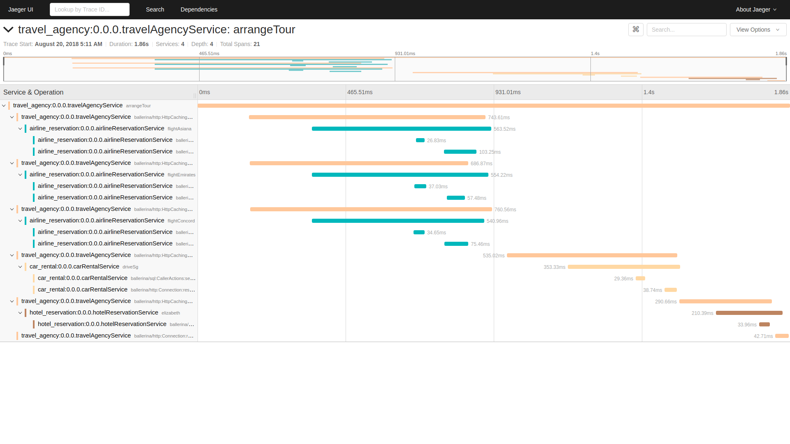
 

### Metrics
Metrics and alerts are built-in with ballerina. We will use Prometheus as the monitoring tool.
Follow the below steps to set up Prometheus and view metrics Ballerina services.

- Set the below configurations in the `ballerina.conf` file.
```
    [b7a.observability.metrics]
    # Flag to enable Metrics
    enabled=true

    [b7a.observability.metrics.prometheus]
    # Port and Host, on which the metrics will be published to be consumed by Prometheus 
    # http://localhost:9796/metrics This HTTP endpoint is hosted by Ballerina to publish the metrics data
    port=9796
    host="0.0.0.0"
```
`ballerina.conf` file defines 9796 as the default port on which, ballerina services will publish its metrics information to be consumed by Prometheus. Ballerina will host Travel agency service's metrics on [http://localhost:9796/metrics](http://localhost:9796/metrics) endpoint. For remaining services we define different ports by passing arguments `-e b7a.observability.metrics.prometheus.port=xxxx`. Prometheus scrapes the given target endpoints within defined interval to extract the metrics information, which will then be visualized via Grafana.

- Create a file `prometheus.yml` inside `/tmp/` location. Add the below configurations to the `prometheus.yml` file.
```
   global:
   scrape_interval:     15s
   evaluation_interval: 15s

   scrape_configs:
    - job_name: 'prometheus'
   
   static_configs:
        - targets: ['0.0.0.0:9796', '0.0.0.0:9797', '0.0.0.0:9798', '0.0.0.0:9799']
```

   NOTE : Replace `0.0.0.0` with your local Docker IP, if you are deplyoing the services in Docker. We've added multiple targets with differnt ports as we are publishing data from 4 different services and expect Prometheus to capture them all.
   
- Run the Prometheus docker image using the following command (If you haven't already started Prometheus as instructed in the [prerequisites](#prerequisites) section. Make sure you've reconfigured `prometheus.yml` file as above to suite this sample)
```
   docker run -p 19090:9090 -v /tmp/prometheus.yml:/etc/tmp/prometheus.yml prom/prometheus
```
   
- You can access Prometheus at the following URL
```
   http://localhost:19090/
```

   NOTE:  Ballerina will by default have following metrics for HTTP server connector. You can enter following expression in Prometheus UI
   
  		-  http_requests_total
		-  http_response_time

- Promethues UI with metrics for Ballerina observability
   
   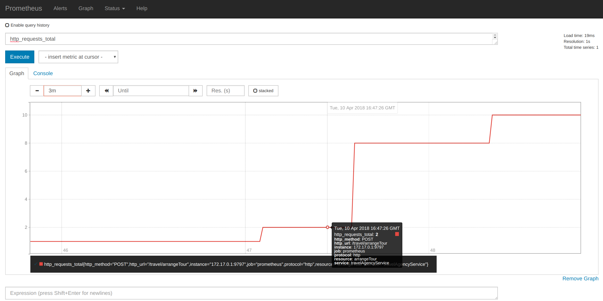

### Logging
Ballerina has a log package for logging to the console. You can import ballerina/log package and start logging. The following section will describe how to search, analyze, and visualize logs in real time using Elastic Stack.

- Start the Ballerina Service with the following command from `microservices-observability/guide`
```
   nohup ballerina run travel_agency/ &>> ballerina.log&
```

NOTE: This will write the console log to the `ballerina.log` file in the `microservices-observability/guide` directory

- Start Elasticsearch using the following command
```
   docker run -p 9200:9200 -p 9300:9300 -it -h elasticsearch --name \
   elasticsearch docker.elastic.co/elasticsearch/elasticsearch:6.2.2 
```

NOTE: Linux users might need to run `sudo sysctl -w vm.max_map_count=262144` to increase `vm.max_map_count` 
   
- Start Kibana plugin for data visualization with Elasticsearch
```
   docker run -p 5601:5601 -h kibana --name kibana --link elasticsearch:elasticsearch \
   docker.elastic.co/kibana/kibana:6.2.2     
```

- Configure logstash to format the ballerina logs
   
i) Create a file named `logstash.conf` with the following content
```
input {  
beats { 
       port => 5044 
      }  
}

filter {  
grok  {  
       match => { 
	  "message" => "%{TIMESTAMP_ISO8601:date}%{SPACE}%{WORD:logLevel}%{SPACE}
	  \[%{GREEDYDATA:package}\]%{SPACE}\-%{SPACE}%{GREEDYDATA:logMessage}"
	 }  
}  
}   

output {  
elasticsearch {  
   hosts => "elasticsearch:9200"  
   index => "store"  
   document_type => "store_logs"  
      }  
}  
```

NOTE: We have declared `store` as the index using `index => "store"` statement.

      
ii) Save the above `logstash.conf` inside a directory named as `{SAMPLE_ROOT}\pipeline`
     
iii) Start the logstash container, replace the {SAMPLE_ROOT_DIRECTORY} with your directory name
```
   docker run -h logstash --name logstash --link elasticsearch:elasticsearch -it --rm \
   -v {SAMPLE_ROOT}/pipeline:/usr/share/logstash/pipeline/ \
   -p 5044:5044 docker.elastic.co/logstash/logstash:6.2.2
```
  
 - Configure filebeat to ship the ballerina logs
    
   i) Create a file named `filebeat.yml` with the following content
```
   filebeat.prospectors:
       - type: log
   paths:
       - /usr/share/filebeat/ballerina.log
   output.logstash:
         hosts: ["logstash:5044"]
```

   ii) Save the above `filebeat.yml` inside a directory named as `{SAMPLE_ROOT_DIRECTORY}\filebeat`   
        
  iii) Start the logstash container, replace the {SAMPLE_ROOT_DIRECTORY} with your directory name  
```
   docker run -v {SAMPLE_ROOT}/filebeat/filebeat.yml:/usr/share/filebeat/filebeat.yml \
   -v {SAMPLE_ROOT}/guide/travel_agency/ballerina.log:/usr/share/filebeat/ballerina.log \
   --link logstash:logstash docker.elastic.co/beats/filebeat:6.2.2
```

- Access Kibana to visualize the logs using following URL
```
     http://localhost:5601 
```

NOTE: You may need to add `store` index pattern to kibana visualization tool to create a log visualization.
    
- Kibana log visualization for Ballerina observability guide sample
 
     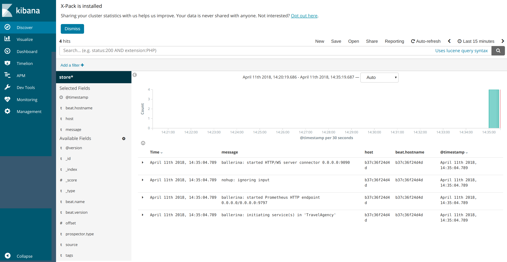
     
## Usages of Observalbility

All four Ballerina services push tracers to Jaeger on port `5775`. Send a request to the travel agency service and check the Jaeger results.
```bash
   curl -v -X POST -d \
   '{"ArrivalDate":"2007-11-06", "DepartureDate":"2007-11-06", "From":"CMB", "To":"DXB", 
   "VehicleType":"Car", "Location":"Changi"}' \
   "http://localhost:9090/travel/arrangeTour" -H "Content-Type:application/json" 
```
Access the Jaeger UI `http://localhost:16686`

Select `travel_agency:0.0.0.travelAgencyService` service from the services list.

Select `arrangeTour` operation from operations list and then click Find traces.

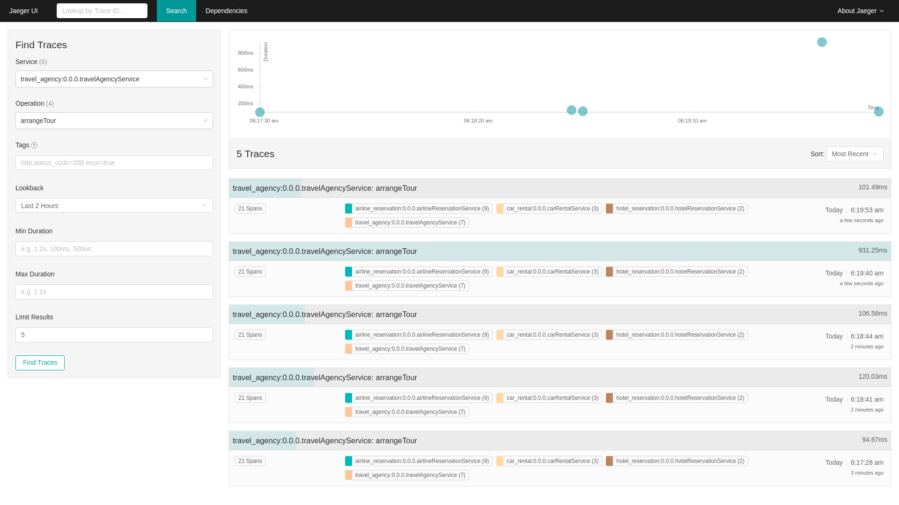

- Duration against Time graph shows total time taken by each request to respond. You can identify a delay in a selected service at a given time by this.
- Request count to the selected service and operation is the number of traces.
- Can filter results further by, Min Duration, Max Duration, Tags. If you want to identify if a service has taken any longer than 500ms to respond, or number of requests that has been succeeded (`http.status_code=200`), can use these filters.

Expand a trace : 

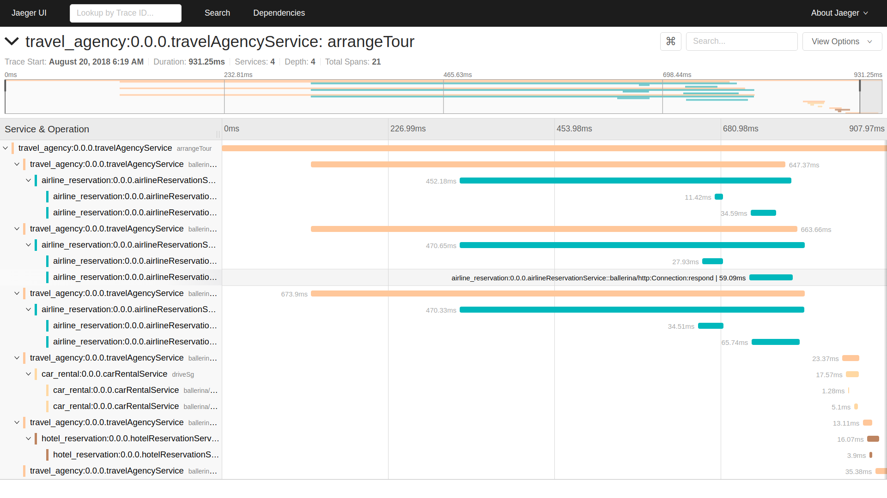
- Each service is represented with a unique colour.
- Three parallel network calls to air line service can clearly be identified by the top graph.

### Identifying the bottleneck
If the request has taken longer time to respond, we can identify the bottleneck by using the details in the graph. To demonstrate this, let's uncomment the below line in `airline_reservation_service.bal` file and restart the service. Send the request again and observe the delay on response due to added delay on airlineDBservice. (Make sure to revert the changes afterward)

`runtime:sleep(1000);`

Normal service call :

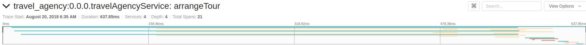

Delayed service call : 

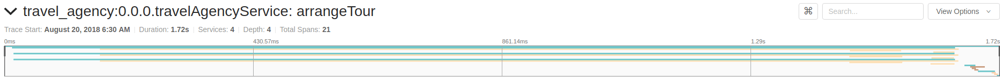

Green lines belong to the `airline_reservation_service`. It can be seen from the comparison that this service is the culprit for the delay. Expanding the relavent span will show more information like duration taken. This method can be used to identify the bottleneck webservice or database call.

 ### Identifying the unavailble service
In a service chaining scenario, one  or more Ballerina services may be unavailable at a time. Jaeger traces can be used to identify these services. In order to demonstrate this, let's shutdown the `car_rental_service.bal` service and send another request.

Response
```bash
< HTTP/1.1 500 Internal Server Error
< content-type: text/plain
< content-length: 11
< server: ballerina/0.980.0
< date: Sun, 5 Aug 2018 00:25:25 +0530
< 
* Connection #0 to host localhost left intact
call failed
```
Jaeger traces

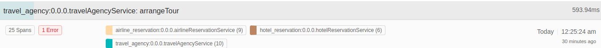

If we expand this errornous trace, and expand its Spans too, we can identify the unavailable service as below. Observe the `http.url` property with the value of `/car/driveSeg`. Here the `travel_agency_service` is trying to call the `car_rental_service` and it's returning `http.status.code` of 502. Therefore, errornous service is `car_rental_service`.

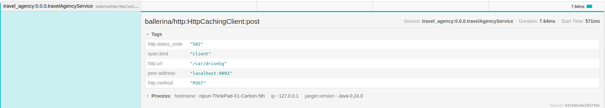

### Determining database call duration and bottleneck queries
Jaeger traces includes spans for database operations. Below is the SELECT query which is being executed inside the `airline_reservation_service`.

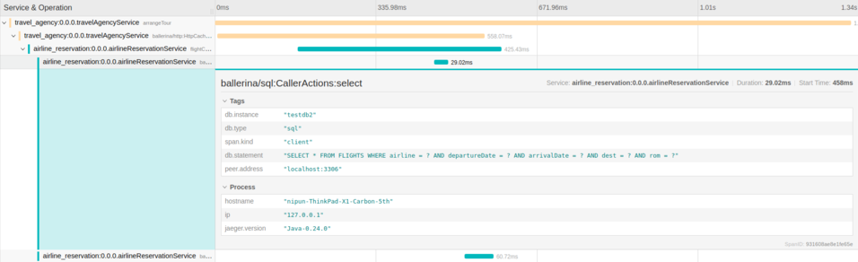

This span includes the information of what the query is, duration of database call, etc. Note that this duration is not the query execution time on databse server, rather the combination of query execution time and the network delay.

However, this information is useful to isolate if a particular query is taking too long, whereas other queries to the same database server are performing comparatively good.

### Function execution time
This involves Ballerina's user-defined observability feature. In order to use this, we need to import `ballerina/observe` package. Default observability only covers action calls done in Ballerina. But let's say that we want to measure the time taken to execute a particular function.
```ballerina
int spanId = check observe:startSpan("Invoking airlineDBService function");
json flightDetails = untaint airlineDBService(airline, departureDate, arrivalDate, to, rom);
_ = observe:finishSpan(spanId);
```
This will be displayed as a separate span in the Jaeger UI to represent the time taken to execute the logic in between the startSpan tag and the finishSpan tag.

Let's find out the time taken by all three airline reservation service resources. Uncomment the below two lines in Travel agency service and restart the service.
```ballerina
int spanId = check observe:startSpan("Call all the airlines");

...

_ = observe:finishSpan(spanId);
```
Send a request and observe the new span in the trace as below.

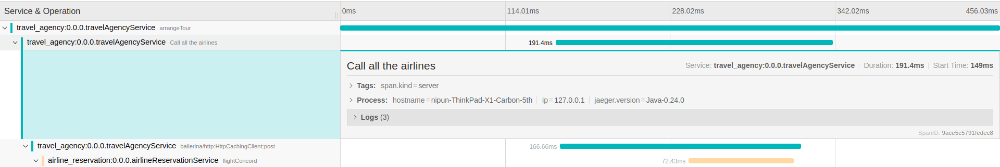

This span has network calls for all three airline resources as its child spans. Therefore, this represents the time taken by these three parallel service calls in total.

## Deployment

You can deploy the services using any of the methods listed below. 

### Deploying locally

- As the first step, you can build Ballerina executable archives (.balx) of the services that we developed above. Navigate to `microservices-observability/guide` and run the following command. 
```bash
   $ ballerina build <Package_Name>
```

- Once the .balx files are created inside the target folder, you can run them using the following command. 
```bash
   $ ballerina run target/<Exec_Archive_File_Name> -e b7a.observability.metrics.prometheus.port=97xx
```

- The successful execution of a service will show us something similar to the following output. 
```
   ballerina: initiating service(s) in 'target/travel_agency.balx'
   ballerina: started HTTP/WS endpoint 0.0.0.0:9090
```

### Deploying on Docker

You can run the service that we developed above as a docker container. As Ballerina platform includes [Ballerina_Docker_Extension](https://github.com/ballerinax/docker), which offers native support for running ballerina programs on containers, you just need to put the corresponding docker annotations on your service code. 

Let's see how we can deploy the travel_agency_service we developed above on docker. When invoking this service make sure that the other three services (airline_reservation, hotel_reservation, and car_rental) are also up and running. 

- In our travel_agency_service, we need to import  `ballerinax/docker` and use the annotation `@docker:Config` as shown below to enable docker image generation during the build time. 

##### travel_agency_service_parallel.bal
```ballerina
import ballerina/http;
import ballerinax/docker;

@docker:Config {
    registry:"ballerina.guides.io",
    name:"travel_agency_service",
    tag:"v1.0"
}

@docker:Expose{}
endpoint http:Listener travelAgencyEP {
    port:9090
};

// http:Client endpoint definitions to communicate with other services

@http:ServiceConfig {basePath:"/travel"}
service<http:Service> travelAgencyService bind travelAgencyEP {
``` 

- Now you can build a Ballerina executable archive (.balx) of the service that we developed above, using the following command. This will also create the corresponding docker image using the docker annotations that you have configured above. Navigate to `microservices-observability/guide` and run the following command.  
  
```
   $ ballerina build travel_agency
  
   Run following command to start docker container: 
   docker run -d -p 9090:9090 ballerina.guides.io/travel_agency_service:v1.0
```

- Once you successfully build the docker image, you can run it with the `` docker run`` command that is shown in the previous step.  

```bash
   $ docker run -d -p 9090:9090 ballerina.guides.io/travel_agency_service:v1.0
```

   Here we run the docker image with flag`` -p <host_port>:<container_port>`` so that we use the host port 9090 and the container port 9090. Therefore you can access the service through the host port. 

- Verify docker container is running with the use of `` $ docker ps``. The status of the docker container should be shown as 'Up'. 
- You can access the service using the same curl commands that we've used above. 
 
```bash
   curl -v -X POST -d \
   '{"ArrivalDate":"12-03-2018", "DepartureDate":"13-04-2018", "From":"Colombo",
   "To":"Changi", "VehicleType":"Car", "Location":"Changi"}' \
   "http://localhost:9090/travel/arrangeTour" -H "Content-Type:application/json"
```


### Deploying on Kubernetes

- You can run the service that we developed above, on Kubernetes. The Ballerina language offers native support for running a ballerina programs on Kubernetes, with the use of Kubernetes annotations that you can include as part of your service code. Also, it will take care of the creation of the docker images. So you don't need to explicitly create docker images prior to deploying it on Kubernetes. Refer to [Ballerina_Kubernetes_Extension](https://github.com/ballerinax/kubernetes) for more details and samples on Kubernetes deployment with Ballerina. You can also find details on using Minikube to deploy Ballerina programs. 

- Let's now see how we can deploy our `travel_agency_service` on Kubernetes. When invoking this service make sure that the other three services (airline_reservation, hotel_reservation, and car_rental) are also up and running. 

- First we need to import `ballerinax/kubernetes` and use `@kubernetes` annotations as shown below to enable kubernetes deployment for the service we developed above. 

##### travel_agency_service_parallel.bal

```ballerina
import ballerina/http;
import ballerinax/kubernetes;

@kubernetes:Ingress {
  hostname:"ballerina.guides.io",
  name:"ballerina-guides-travel-agency-service",
  path:"/"
}

@kubernetes:Service {
  serviceType:"NodePort",
  name:"ballerina-guides-travel-agency-service"
}

@kubernetes:Deployment {
  image:"ballerina.guides.io/travel_agency_service:v1.0",
  name:"ballerina-guides-travel-agency-service"
}

// Service endpoint
endpoint http:Listener travelAgencyEP {
    port:9090
};

// http:Client endpoint definitions to communicate with other services

@http:ServiceConfig {basePath:"/travel"}
service<http:Service> travelAgencyService bind travelAgencyEP {     
``` 

- Here we have used ``  @kubernetes:Deployment `` to specify the docker image name which will be created as part of building this service. 
- We have also specified `` @kubernetes:Service `` so that it will create a Kubernetes service which will expose the Ballerina service that is running on a Pod.  
- In addition we have used `` @kubernetes:Ingress `` which is the external interface to access your service (with path `` /`` and host name ``ballerina.guides.io``)

- Now you can build a Ballerina executable archive (.balx) of the service that we developed above, using the following command. This will also create the corresponding docker image and the Kubernetes artifacts using the Kubernetes annotations that you have configured above.
  
```
   $ ballerina build travel_agency
  
   Run following command to deploy kubernetes artifacts:  
   kubectl apply -f ./target/travel_agency/kubernetes
```

- You can verify that the docker image that we specified in `` @kubernetes:Deployment `` is created, by using `` docker images ``. 
- Also the Kubernetes artifacts related our service, will be generated under `` ./target/travel_agency/kubernetes``. 
- Now you can create the Kubernetes deployment using:

```bash
   $ kubectl apply -f ./target/travel_agency/kubernetes 
 
   deployment.extensions "ballerina-guides-travel-agency-service" created
   ingress.extensions "ballerina-guides-travel-agency-service" created
   service "ballerina-guides-travel-agency-service" created
```

- You can verify Kubernetes deployment, service and ingress are running properly, by using following Kubernetes commands. 

```bash
   $ kubectl get service
   $ kubectl get deploy
   $ kubectl get pods
   $ kubectl get ingress
```

- If everything is successfully deployed, you can invoke the service either via Node port or ingress. 

Node Port:
```bash
   curl -v -X POST -d \
   '{"ArrivalDate":"12-03-2018", "DepartureDate":"13-04-2018", "From":"Colombo", 
   "To":"Changi", "VehicleType":"Car", "Location":"Changi"}' \
   "http://localhost:<Node_Port>/travel/arrangeTour" -H "Content-Type:application/json"  
```

Ingress:

Add `/etc/hosts` entry to match hostname. 
``` 
   127.0.0.1 ballerina.guides.io
```

Access the service 
```bash 
   curl -v -X POST -d \
   '{"ArrivalDate":"12-03-2018", "DepartureDate":"13-04-2018", "From":"Colombo",
   "To":"Changi", "VehicleType":"Car", "Location":"Changi"}' \
   "http://ballerina.guides.io/travel/arrangeTour" -H "Content-Type:application/json"  
```


